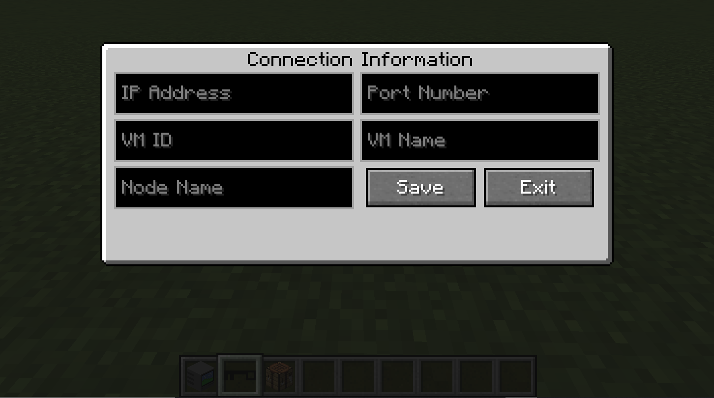

# VMCraft-II
This is the official repository of VMCraft-II, An enterprise virtualization mod for minecraft.

There is a large demand for cybersecurity workers in today’s economy and world. One reason for this shortage is the lack of interest in younger audiences to cybersecurity. This Minecraft mod creates a platform for students to simulate real-life scenarios from the exciting aspect of a computer game. 

After having improved upon our predecessors who created VMCraft (1), we have created enterprise-virtualization mod that allows users of the mod to create, in minecraft, a computer or laptop (same functionality) block. Once placed, using a configuration key, the user can configure the laptop to connect to an internal or external enterprise server (tested with Proxmox) which hosts virtual machine(s). After configured, the user can then right click on the block and a browser will open. The browser contains a remote desktop GUI for the virtual machine to which you are connecting to. 

## User Installation 
1. Download a jar file somewhere (Not there yet)
2. Place jar file in a specific location (somewhere we'll help)
3. Play Minecraft
4. Build/create laptop or computer. Find config key (in creative mode block menu).
  pics here later...
5. Place block, use key on block to configure
6. Enter connection info of server

7. Right click on Block (no key in hand)

Should see designated virtual machine remote desktop at this point in browser
Currently, non-persistent between sessions/if block is broken (Config information will be lost)

## Developer Installation
1. Install MCreator
2. Set-up testing server (personal choice) (We used [Proxmox](https://proxmox.com/en/))
3. More instructions later
